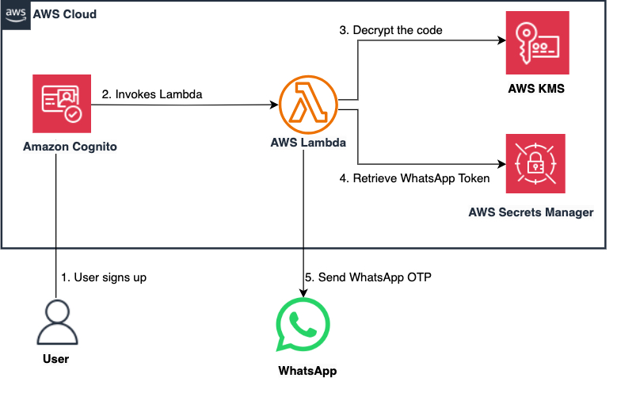

# How to use WhatsApp to send Amazon Cognito notification messages

This repository offers guidance on how to use an Amazon Cognito Userpool's custom SMS sender Lambda trigger to send OTP messages on WhatsApp when a user signs up.


Amazon Cognito lets you easily add user sign-up and authentication to your mobile and web apps. Amazon Cognito works with external identity providers that support SAML or OpenID Connect, social identity providers (such as Facebook, Twitter, Amazon) and you can also integrate your own identity provider.


By default, Amazon Cognito uses Amazon Simple Notification Service (Amazon SNS) for delivery of SMS text messages. This can be changed with the help of custom SMS sender trigger. When you assign a custom SMS sender trigger to your user pool, Amazon Cognito invokes a Lambda function instead of its default behavior when a user event requires that it send an SMS message. With a custom sender trigger, your AWS Lambda function can send SMS notifications to your users through a method and provider that you choose. This  This guide will walk you through the process of implementing custom SMS sender Lambda triggers to send one-time password (OTP) messages for user sign up via WhatsApp.


Important: this application uses various AWS services and there are costs associated with these services after the Free Tier usage - please see the [AWS Pricing page](https://aws.amazon.com/pricing/) for details. You are responsible for any AWS costs incurred. No warranty is implied in this example.


## Requirements

* [Create an AWS account](https://portal.aws.amazon.com/gp/aws/developer/registration/index.html) if you do not already have one and log in. The IAM user that you use must have sufficient permissions to make necessary AWS service calls and manage AWS resources.
* [AWS CLI](https://docs.aws.amazon.com/cli/latest/userguide/install-cliv2.html) installed and configured
* [Git Installed](https://git-scm.com/book/en/v2/Getting-Started-Installing-Git)
* [Node and NPM](https://nodejs.org/en/download/) installed
* [AWS Cloud Development Kit](https://docs.aws.amazon.com/cdk/v2/guide/getting_started.html) installed
* [Meta (Facebook) developer account](https://developers.facebook.com/docs/development/register)
* [Docker installed and running](https://docs.aws.amazon.com/serverless-application-model/latest/developerguide/install-docker.html)


## Deployment Instructions

1. [Create an AWS Secrets Manager Secret](https://docs.aws.amazon.com/secretsmanager/latest/userguide/create_secret.html) and set the secret to the WhatsApp Access Token and copy the ARN. This step needs to be performed from AWS console so that the access token is not stored in any of the files or in the command history.

Login into your AWS account and go to AWS Secrets Manager service in the AWS Console in the region of your choice. Then select the Store a new secret button.

For the secret type select Other type of secret and under Key/value pair select the Plaintext tab and enter the WhatsApp access token. For encryption key, you can either encrypt using the AWS KMS key that AWS Secrets Manager creates or a customer managed AWS KMS key that you create. Select Next, provide the Secret name as WhatsAppAccessToken, select Next and click the Store button to create the Secret. Note the secret ARN as this will be needed for the next step.


2. Create a new directory, navigate to that directory in a terminal and clone the GitHub repository:

```
git clone https://github.com/aws-samples/amazon-cognito-whatsapp-otp
```

3. Change directory to the pattern directory:

```
cd amazon-cognito-whatsapp-otp
```

4. We now need to configure the phone number ID obtained from WhatsApp, Secret Name and the Secret ARN.

    * Open lib/constants.ts file and edit the fields

```
export const PHONE_NUMBER_ID = ''; //e.g 0123456789
export const SECRET_NAME = ''; //e.g WhatsAppAccessToken
export const SECRET_ARN = "" //e.g arn:aws:secretsmanager:us-east-1:0123456789:secret:WhatsAppAccessToken
```


5. Run below command to install AWS CDK required dependancies

```
npm install
```


6. This project uses typescript as client language for AWS CDK. Run the below command to compile typescript to javascript

```
npm run build
```

7. From the command line, configure AWS CDK (if you had not done it). Ensure that the region is the same as that used to create the secrets manager:

```
cdk bootstrap ACCOUNT-NUMBER/REGION # e.g. 1111111111/us-east-1
```


**Note:** - [Install docker and run it](https://docs.aws.amazon.com/serverless-application-model/latest/developerguide/install-docker.html) as the aws-lambda-python-alpha package that is used to provide constructs for Python Lambda function will be using Docker.

8. Deploy the stack:

```
cdk synth
cdk deploy
```

**Note:** - Ensure that the CDK stack is deployed in the same region as the AWS Secrets Manager secret


## How it works

This pattern creates an AWS Lambda function which is the custom sms sender Lambda that gets triggered when notification messages are to be sent from Amazon Cognito. The AWS Lambda makes the API call to send the message through WhatsApp. 

These are the steps involved in this pattern:

1. User signs up in Amazon Cognito Userpool
2. Amazon Cognito invokes custom SMS sender AWS Lambda function. Amazon Cognito sends user attributes, including the phone number, and the one-time code(encrypted secrets) to the AWS Lambda function 
3. The AWS Lambda decrypts the one-time code by making use of the Decrypt API call to the AWS KMS Key
4. AWS Lambda obtains the WhatsApp access token from AWS Secrets Manager. AWS Lambda also parses phone number, user attributes and encrypted secrets. 
5. AWS Lambda sends a POST API call to the WhatsApp API and the WhatsApp message gets delivered to the customer.




## **Testing** 

**Signing up a user on Cognito should trigger the Lambda function which will send the OTP**

Run the following CLI command replacing the client ID with the output of cognitocustomsmssenderclientappid from CDK output, username, password, email address, name, phone number, and AWS region to  sign up a new Cognito user


`aws cognito-idp sign-up --client-id <cognitocustomsmssenderclientappid> --username <TestUserPhoneNumber> --password <Password> --user-attributes Name="email",Value="<TestUserEmail>" Name="name",Value="<TestUserName>" Name="phone_number",Value="<TestPhonenumber>" --region <AWSRegion>`

Example:
`aws cognito-idp sign-up --client-id xxxxxxxxxxxxxx --username +123456787990 --password Test@654321 --user-attributes Name="email",Value="jane@example.com" Name="name",Value="Jane" Name="phone_number",Value="+12345678799" --region us-east-1`

**Note:** Password Requirements 8-character minimum length and at least 1 number, 1 lowercase letter, and 1 special character

**Receiving message**
The new user should now receive a message on WhatsApp with the OTP which they can use for verification.


## **Clean Up**

1. Run the given command to delete the resources that were created. It might take some time for the AWS CloudFormation stack to get deleted

```
cdk destroy
```

2. Delete the secret WhatsAppAccessToken that was created on AWS Secrets Manager

----
Copyright 2023 Amazon.com, Inc. or its affiliates. All Rights Reserved.
SPDX-License-Identifier: MIT-0